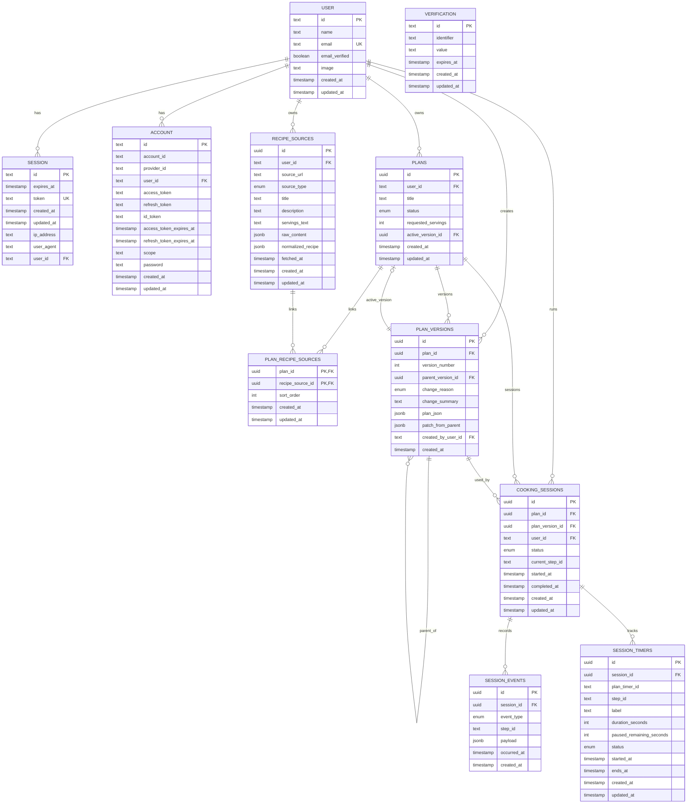

# ER Diagram

Note: `SESSION_TIMERS` does not persist a per-second countdown. While a timer is `running`, the client computes the remaining time from `ends_at`; `paused_remaining_seconds` is stored only for paused or manually adjusted timers. `plan_timer_id` links each session timer back to the timer definition embedded in the plan document.
